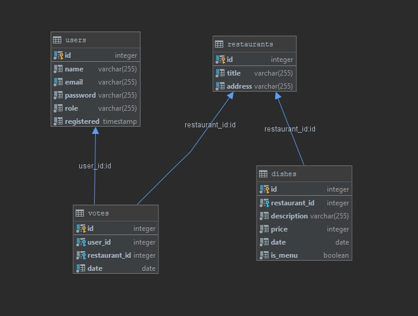

# Voting System, REST API

### (Graduation project Topjava15) 

#### _Specification_:

    Design and implement a REST API using Hibernate/Spring/SpringMVC (or Spring-Boot) **without frontend**.

    The task is:

    Build a voting system for deciding where to have lunch.

    * 2 types of users: admin and regular users
    * Admin can input a restaurant and it's lunch menu of the day (2-5 items usually, just a dish name and price)
    * Menu changes each day (admins do the updates)
    * Users can vote on which restaurant they want to have lunch at
    * Only one vote counted per user
    * If user votes again the same day:
       - If it is before 11:00 we asume that he changed his mind.
      - If it is after 11:00 then it is too late, vote can't be changed

    Each restaurant provides new menu each day.

    As a result, provide a link to github repository.

    It should contain the code and **README.md with API documentation and curl commands to get data for voting and vote.**

#### _Database diagram_:

* Created 41 test from Junit:
  * 26 of them are directed to the services layer,
  * 15 per layer of controllers.  

Stack technology:
1. Java SE
2. Apache Tomcat
3. Apache Maven
4. Spring (Core, MVC, Security, DataJpa)
5. Hibernate
6. HSQLDB
7. JUNIT
8. Logging SLF4J

[->> Curl](curl.md)

[->> API Documentation](API%20Documentation.md)
